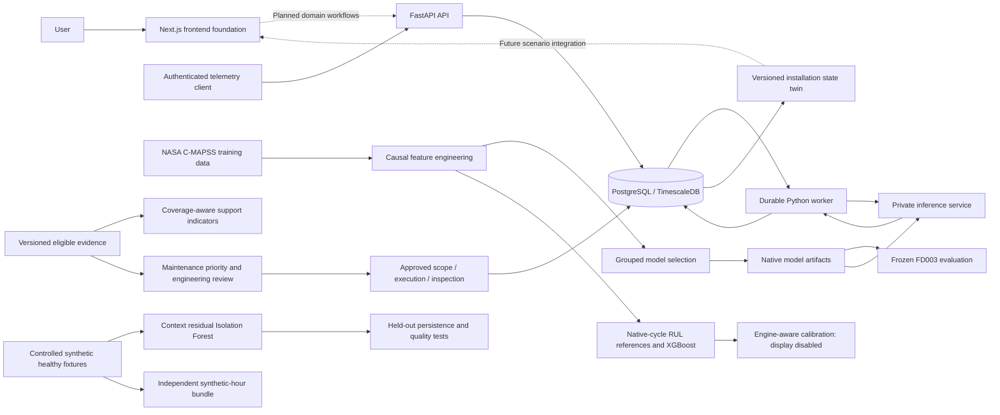

# FleetIQ

Predictive maintenance and fleet availability prototype for **SIH Problem Statement 26249: Air Power — Predictive Maintenance & Fleet Availability**.

FleetIQ aims to connect aircraft health telemetry, technical records, maintenance activity and spares so engineers can identify emerging problems and understand their effect on availability. Development currently reaches **Step 70**, including coverage-aware health indicators, replayable asset state, maintenance priority rules, a separate synthetic-hour model bundle and audited human maintenance workflows. This is a development prototype; benchmark results do not establish fitness for aircraft maintenance decisions.

## Current implementation

- FastAPI service with authentication/session controls and telemetry ingestion.
- PostgreSQL/TimescaleDB schema, migrations and database roles.
- Durable Python worker with database-backed job leases, retries and recovery handling.
- Telemetry validation, replay tooling and causal feature pipelines.
- Next.js frontend foundation; the complete maintenance dashboard remains future work.
- Offline model training, model selection, calibration evidence and frozen evaluation.
- Context-residual Isolation Forest with synthetic persistence/quality robustness evidence.
- Constant/usage/Ridge RUL references, CPU XGBoost comparison and engine-aware interval support checks.
- Digest-anchored native model bundles and authenticated, bounded private inference.
- Worker prediction/explanation jobs with atomic evidence, replay protection and outage recovery.
- Coverage-aware component/aircraft indicators, with unknown results when essential support is missing.
- Installation-scoped twin snapshots with event cutoffs, replay hashes and immutable simulation clones.
- Versioned maintenance priorities and procedure-bound human review, execution, inspection and closure.
- Independently trained and evaluated synthetic-hour models, separate from NASA benchmark parameters.

The NASA models are available through a **private inference API**. Worker inference currently supports explicit NASA benchmark jobs in native cycles; aircraft demo telemetry remains unsupported by those models. The separate synthetic-hour bundle has an offline loader; private API/worker integration for that track remains future work. Stored RUL explanations reconstruct native model output using a fixed training background. Aggregate ensemble probability attribution remains unsupported. Steps 66–70 provide domain services; their complete REST/UI integration, stock reservation, scheduling and scenario simulation remain subsequent stages. Redis and Kafka are conditional additions that require measured benefit. Cloud implementation is deferred while the owner learns Azure.

## Architecture

Solid connections below describe the current service/data boundaries. Dashed connections describe future integration.



The local development setup runs the database through Docker Compose and the API, worker and frontend as separate processes in **WSL Ubuntu**. The current Compose file does not deploy the whole application.

## Failure-model results

The selected model is an equal-weight **XGBoost + CatBoost soft-voting ensemble**. LightGBM and small neural MLP candidates were evaluated, but are not components of the selected prediction ensemble.

The frozen official **FD003 test** evaluation used the last observed cycle of 100 engines, including 20 positives with remaining useful life at or below the configured **30-cycle horizon**. Cycles are benchmark units, not flight hours:

| Metric | Result |
|---|---:|
| Precision | 90.48% |
| Recall | 95.00% |
| F1 score | 92.68% |
| Accuracy | 97.00% |
| Average precision | 99.55% |
| ROC AUC | 99.88% |

| Actual / Predicted | Failure risk | No failure risk |
|---|---:|---:|
| Failure risk | 19 true positives | 1 false negative |
| No failure risk | 2 false positives | 78 true negatives |

Features include 21 sensor channels, means/standard deviations/slopes over 5, 15, 30 and 60 cycles, EWMA, current sensor readings, departures from the first 20 observed readings, short/long trend differences, available-history counts, observed cycle age and three operating settings. The enhanced schema has 386 columns; training-only filtering retains 292 nonconstant columns.

Development uses FD001 and FD003 training engines, with disjoint engine groups for fitting, tuning and calibration. Grouped cross-validation keeps an engine's windows in one fold. Features exclude future readings, engine identity and remaining life. Model selection and the raw operating threshold (`0.35167105415321204`) were frozen before the fresh FD003 final evaluation. Final test outcomes must not be reused for tuning.

These results describe this benchmark and threshold. Only 20 test positives were available, and precise calibrated probability display remains disabled. They do not measure real fleet downtime reduction or performance across all aircraft types.

## Anomaly and remaining-life evidence (Steps 56–65)

The Isolation Forest uses causal sensor residuals against a context model fitted only on explicitly healthy synthetic fixtures. The score is an anomaly score/reference percentile, not failure probability or diagnosis. A tune-only policy requires two consecutive flags and a six-hour cooldown. Independent synthetic evaluation detected 12 of 12 labelled degradation events, with zero false review alerts over 528 valid normal exposure hours. Missing/impossible essential readings abstain, while valid extremes remain evidence. These small controlled fixtures do not establish operational false-alarm rates.

RUL models use the existing FD001 development partitions: 62 fitting engines, 20 tuning engines and 18 calibration engines. All candidates use the same causal features and predetermined ten-cycle anchors from cycle 30, exclude terminal failed rows, and predict uncapped remaining life in **native cycles**. No flight-hour/day conversion is performed.

| Model | Tuning MAE (cycles) | Tuning RMSE (cycles) |
|---|---:|---:|
| Selected Ridge reference | 26.13 | 36.70 |
| Selected CPU XGBoost candidate | 22.92 | 33.43 |

These are engine-weighted development metrics. XGBoost cleared the frozen one-cycle MAE improvement gate. Frozen FD001 endpoint evaluation over 100 engines gives **MAE 14.30 cycles, RMSE 20.35 cycles**, with asymmetric NASA score **2752.00**. FD001 outcomes were previously inspected during classification work, so this is not a fresh untouched holdout. Endpoint data cannot establish operational warning lead time. Engine-max residual calibration counts 18 independent engines rather than hundreds of correlated windows. It falls below the declared 20-engine support floor; the diagnostic candidate radius is also very wide (218.88 cycles). Consequently, **RUL interval display is disabled**.

With prepared local datasets/features, reproduce the new stages from the repository root:

```bash
source scripts/env.sh
uv run python -m fleetiq_training --task anomaly --model isolation_forest --track synthetic_sensor_model --config config/experiments.yaml --output artifacts/anomaly
uv run python -m fleetiq_evaluation.anomaly
uv run python -m fleetiq_training --task rul --model ridge --track cmapss_benchmark --config config/experiments.yaml --output artifacts/rul_ridge
uv run python -m fleetiq_training --task rul --model xgboost --track cmapss_benchmark --config config/experiments.yaml --output artifacts/xgb_rul
uv run python -m fleetiq_training.rul_intervals
uv run python -m fleetiq_evaluation --task rul --config config/experiments.yaml --bundle artifacts/rul_calibrated --output docs/exports/rul_evaluation.json
```

## Health, asset state and maintenance workflows (Steps 66–70)

Component support scores use `100 × (1 − calibrated probability)` only with eligible, fresh evidence for the requested horizon, unit and approved bundle. Aircraft indicators use the minimum eligible critical-component score; absent essential coverage produces an unknown score. These indicators do not change aircraft serviceability. Current model probability-display restrictions therefore also restrict health scores.

The state twin retains separate installation histories, filters by observation time and recording cutoff, and produces immutable snapshots with replay hashes. Maintenance priorities explain constraints, deadlines, compatible lower-RUL resource margins and supported risk/anomaly evidence. NASA cycles are never converted into operating hours. Fictional task templates require engineering review.

The workflow service rechecks actor permissions and record versions, binds tasks and part quantities to immutable approved procedures, and writes audits/outbox events atomically. Technical approval and human plan approval are separate. Completed tasks require an independent passing inspection before explicit release and closure. Stock transactions and resource scheduling start after Step 70; workflow release does not automatically set aircraft serviceability.

The independent synthetic model uses 13 observed features: causal context residuals, five-reading means/slopes, workload, ambient conditions, observed age and operating hours. Its 24-hour risk model was selected before independent calibration/test generation. Final evaluation over 64 test engines gives **precision 73.21%, recall 23.70%, F1 35.81%, accuracy 79.95%** across 733 eligible windows, and detects 16 of 49 eligible failure events. There were 15 false alert windows over 4,386 exposure hours; correlated windows are not independent review events. This failure-risk model remains weak.

Native-hour Ridge RUL evaluation gives **MAE 23.43 operating hours, RMSE 30.70 hours** on 49 uncensored engines. Diagnostic intervals are wide (mean width 156.62 hours); calibrated probability and interval display remain disabled. A separate controlled anomaly fixture detected 12 of 12 degradation events with no false review alerts over 528 normal hours. These fixture results do not establish fleet performance.

```bash
source scripts/env.sh
uv run python scripts/train_synthetic_track.py --config config/experiments.yaml --output artifacts/bundles/synthetic
uv run pytest tests/unit/test_health_score.py tests/unit/test_maintenance_priority.py tests/ml/test_synthetic_track.py
uv run pytest tests/integration/test_twin_projection.py tests/integration/test_workflow_transitions.py
```

Training creates ignored local artifacts and evaluation receipts. Treat a new training run as a new experiment; recorded final-test outcomes must not become tuning inputs.

## Local setup in WSL Ubuntu

Prerequisites: Ubuntu under WSL, Docker Desktop with Ubuntu integration enabled, Python 3.12, `uv`, and Node.js matching `.nvmrc` (24.21.0). Run the following from the checkout's root in Ubuntu. `scripts/env.sh` also recognizes the project's optional bundled Node runtime.

```bash
source scripts/env.sh
uv sync --locked
uv run python scripts/create_db_secrets.py --port 5433
source scripts/env.sh
docker compose up -d db
uv run fleetiq-migrate upgrade head
```

Wait for the database to become healthy before migrating (`docker compose ps`). The tracked `config/images.env` supplies the pinned TimescaleDB image. Secret generation preserves existing credentials and uses private Linux storage; do not print or commit `.env` or secret files.

Start the API:

```bash
source scripts/env.sh
uv run uvicorn fleetiq_api.main:app --host 127.0.0.1 --port 8000
```

In another Ubuntu terminal, start the worker:

```bash
source scripts/env.sh
uv run fleetiq-worker
```

For private inference, first build an immutable local bundle from the prepared artifacts:

```bash
uv run python -m fleetiq_registry.bundle --config config/experiments.yaml --output artifacts/bundles/release-v1
```

Set `MODEL_BUNDLE_PATH` to that directory and `MODEL_BUNDLE_SHA256` to its approved manifest digest recorded in the local build receipt. Preserve the private `INFERENCE_WORKLOAD_TOKEN` generated during setup. Then start the service from the repository root:

```bash
source scripts/env.sh
uv run uvicorn fleetiq_inference.main:app --host 127.0.0.1 --port 8001
```

Readiness is available at `/health/ready`; authenticated batches use `/internal/v1/predict`. Prediction jobs require an explicit matching registered benchmark deployment. The worker stores historical benchmark evidence and queues explanations; it does not turn NASA cycle predictions into aircraft flight-hour estimates. Anomaly scoring is limited to the controlled synthetic sensor-model scope.

In another Ubuntu terminal, start the frontend:

```bash
source scripts/env.sh
cd apps/web
npm ci
npm run dev -- --hostname 127.0.0.1 --port 3000
```

- Frontend: <http://localhost:3000>
- API explorer: <http://localhost:8000/docs>
- Process liveness: <http://localhost:8000/health/live>

Liveness does not establish database readiness or completed inference integration. Dataset preparation, replay provisioning and model artifacts are separate from starting these services. Datasets and trained artifacts are excluded from Git, so a fresh clone does not contain the recorded trained model.

## Verification

```bash
source scripts/env.sh
uv run ruff check .
uv run ruff format --check .
uv run pytest -m 'not integration and not e2e'
python3 scripts/check_repository.py
```

Database integration tests require configured isolated test databases and a running database. Historical full regression evidence after the Step 55 model improvement recorded **251 passed tests and 248 subtests**; this is a recorded run, not a guarantee about an unconfigured checkout. Steps 56–60 add focused anomaly/RUL tests; database integration tests are separate from the non-integration checks above.

## Repository layout and policy

| Directory | Purpose |
|---|---|
| `apps/api`, `apps/web` | API and frontend |
| `services/worker`, `services/ml-inference` | Worker and inference foundation |
| `packages` | Domain, data, features and other shared modules |
| `ml` | Training, evaluation and registry code |
| `config`, `infrastructure` | Experiment configuration and infrastructure |
| `scripts`, `tests` | Development tooling and verification |
| `docs`, `data`, `artifacts` | Ignored planning/evidence, datasets and model outputs |

**This root README is the sole authorized tracked Markdown exception.** All other human documentation stays under ignored `docs/`. Never commit credentials, local datasets, trained model artifacts or generated reports. Use focused commits for implementation changes.

The future deployment candidate is an Azure Ubuntu VM. Total prototype cloud expenditure must stay **below US$300**; provisionally plan within US$99 until actual student-credit currency and balance are verified. No cloud deployment or paid billing upgrade has been performed. AWS portability testing is optional later work, and Google Cloud is deferred.
