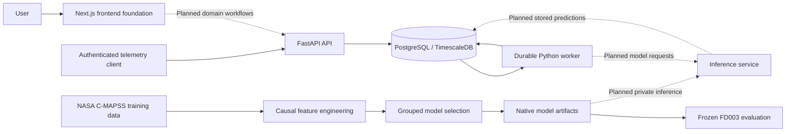

# FleetIQ

Predictive maintenance and fleet availability prototype for **SIH Problem Statement 26249: Air Power — Predictive Maintenance & Fleet Availability**.

FleetIQ aims to connect aircraft health telemetry, technical records, maintenance activity and spares so engineers can identify emerging problems and understand their effect on availability. Development currently stops at **Step 55**, including an improved, independently evaluated failure-risk model. This is a development prototype; benchmark results do not establish fitness for aircraft maintenance decisions.

## Current implementation

- FastAPI service with authentication/session controls and telemetry ingestion.
- PostgreSQL/TimescaleDB schema, migrations and database roles.
- Durable Python worker with database-backed job leases, retries and recovery handling.
- Telemetry validation, replay tooling and causal feature pipelines.
- Next.js frontend foundation; the complete maintenance dashboard remains future work.
- Offline model training, model selection, calibration evidence and frozen evaluation.

The improved failure model is **not yet integrated into the API**. Anomaly detection, remaining-useful-life models, explanations, maintenance scheduling, simulation and the full UI remain subsequent stages. Redis and Kafka are conditional additions that require measured benefit. Cloud implementation is deferred while the owner learns Azure.

## Architecture

Solid connections below describe the current service/data boundaries. Dashed connections describe future integration.



The local development setup runs the database through Docker Compose and the API, worker and frontend as separate processes in **WSL Ubuntu**. The current Compose file does not deploy the whole application.

## Failure-model results

The selected model is an equal-weight **XGBoost + CatBoost soft-voting ensemble**. LightGBM and small neural MLP candidates were evaluated, but are not components of the selected prediction ensemble.

The frozen official **FD003 test** evaluation used the last observed cycle of 100 engines, including 20 positives with remaining useful life at or below the configured **30-cycle horizon**. Cycles are benchmark units, not flight hours:

| Metric | Result |
|---|---:|
| Precision | 90.48% |
| Recall | 95.00% |
| F1 score | 92.68% |
| Accuracy | 97.00% |
| Average precision | 99.55% |
| ROC AUC | 99.88% |

| Actual / Predicted | Failure risk | No failure risk |
|---|---:|---:|
| Failure risk | 19 true positives | 1 false negative |
| No failure risk | 2 false positives | 78 true negatives |

Features include 21 sensor channels, means/standard deviations/slopes over 5, 15, 30 and 60 cycles, EWMA, current sensor readings, departures from the first 20 observed readings, short/long trend differences, available-history counts, observed cycle age and three operating settings. The enhanced schema has 386 columns; training-only filtering retains 292 nonconstant columns.

Development uses FD001 and FD003 training engines, with disjoint engine groups for fitting, tuning and calibration. Grouped cross-validation keeps an engine's windows in one fold. Features exclude future readings, engine identity and remaining life. Model selection and the raw operating threshold (`0.35167105415321204`) were frozen before the fresh FD003 final evaluation. Final test outcomes must not be reused for tuning.

These results describe this benchmark and threshold. Only 20 test positives were available, and precise calibrated probability display remains disabled. They do not measure real fleet downtime reduction or performance across all aircraft types.

## Local setup in WSL Ubuntu

Prerequisites: Ubuntu under WSL, Docker Desktop with Ubuntu integration enabled, Python 3.12, `uv`, and Node.js matching `.nvmrc` (24.21.0). Run the following from the checkout's root in Ubuntu. `scripts/env.sh` also recognizes the project's optional bundled Node runtime.

```bash
source scripts/env.sh
uv sync --locked
uv run python scripts/create_db_secrets.py --port 5433
source scripts/env.sh
docker compose up -d db
uv run fleetiq-migrate upgrade head
```

Wait for the database to become healthy before migrating (`docker compose ps`). The tracked `config/images.env` supplies the pinned TimescaleDB image. Secret generation preserves existing credentials and uses private Linux storage; do not print or commit `.env` or secret files.

Start the API:

```bash
source scripts/env.sh
uv run uvicorn fleetiq_api.main:app --host 127.0.0.1 --port 8000
```

In another Ubuntu terminal, start the worker:

```bash
source scripts/env.sh
uv run fleetiq-worker
```

In another Ubuntu terminal, start the frontend:

```bash
source scripts/env.sh
cd apps/web
npm ci
npm run dev -- --hostname 127.0.0.1 --port 3000
```

- Frontend: <http://localhost:3000>
- API explorer: <http://localhost:8000/docs>
- Process liveness: <http://localhost:8000/health/live>

Liveness does not establish database readiness or completed inference integration. Dataset preparation, replay provisioning and model artifacts are separate from starting these services. Datasets and trained artifacts are excluded from Git, so a fresh clone does not contain the recorded trained model.

## Verification

```bash
source scripts/env.sh
uv run ruff check .
uv run ruff format --check .
uv run pytest -m 'not integration and not e2e'
python3 scripts/check_repository.py
```

Database integration tests require configured isolated test databases and a running database. Historical full regression evidence after the model improvement recorded **251 passed tests and 248 subtests**; this is a recorded run, not a guarantee about an unconfigured checkout.

## Repository layout and policy

| Directory | Purpose |
|---|---|
| `apps/api`, `apps/web` | API and frontend |
| `services/worker`, `services/ml-inference` | Worker and inference foundation |
| `packages` | Domain, data, features and other shared modules |
| `ml` | Training, evaluation and registry code |
| `config`, `infrastructure` | Experiment configuration and infrastructure |
| `scripts`, `tests` | Development tooling and verification |
| `docs`, `data`, `artifacts` | Ignored planning/evidence, datasets and model outputs |

**This root README is the sole authorized tracked Markdown exception.** All other human documentation stays under ignored `docs/`. Never commit credentials, local datasets, trained model artifacts or generated reports. Use focused commits for implementation changes.

The future deployment candidate is an Azure Ubuntu VM. Total prototype cloud expenditure must stay **below US$300**; provisionally plan within US$99 until actual student-credit currency and balance are verified. No cloud deployment or paid billing upgrade has been performed. AWS portability testing is optional later work, and Google Cloud is deferred.
